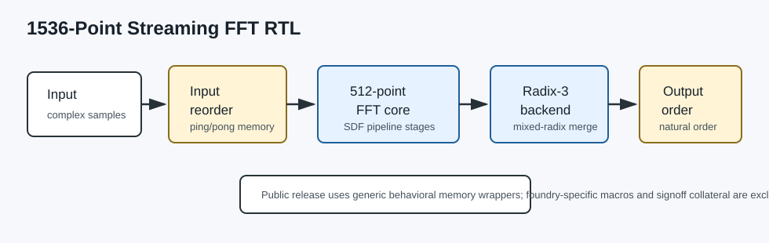
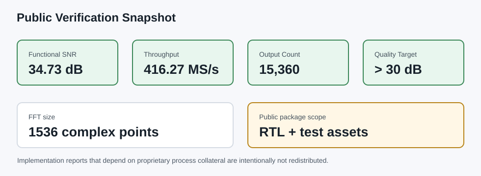

# 1536-Point Streaming FFT RTL

This repository contains a public, de-identified RTL release of a 1536-point
streaming FFT design. It keeps the synthesizable algorithmic RTL, testbench
assets, fixed-point tables, and public verification summary while excluding
foundry-specific SRAM macros, PDK files, APR scripts, signoff decks, and any
private user or environment information.



## Specification

- Transform size: 1536 complex points.
- Decomposition: mixed-radix 1536 = 3 x 512.
- Core architecture: streaming 512-point FFT pipeline followed by a radix-3
  backend.
- Output order: natural order.
- Numeric format: fixed-point integer datapath with quantized twiddle tables.
- Quality target: SNR greater than 30 dB on the public regression vectors.
- Public memory model: generic behavioral memory wrappers are provided for
  simulation and source review.

## Public Report Snapshot



The latest public functional snapshot showed:

- SNR: 34.73 dB.
- Throughput: 416.27 MS/s.
- Output count: 15,360 samples in the regression run.

Physical implementation and signoff reports are not redistributed because they
depend on proprietary process collateral and licensed tool decks.

## Repository Layout

```text
00_TESTBED/       Public testbench files and regression vectors
01_RTL/src/       FFT RTL, memory wrappers, and twiddle ROMs
docs/             Public diagrams and report-summary images
rtl.f             File list for the public RTL source tree
```

## Running RTL Simulation

Use the file list in `rtl.f`, or the source-local list in
`01_RTL/src/filelist_rtl_sim_512only.f`, with your simulator of choice.

Example source order:

```text
01_RTL/src/CHIP.v
01_RTL/src/Top_PureDIT.v
01_RTL/src/sram512x45_sp.v
01_RTL/src/sram128x64_sp.v
01_RTL/src/fft512_dit_sdf_core.v
01_RTL/src/fft512_dit_sdf_stage.v
01_RTL/src/radix3_back_end.v
01_RTL/src/complex_mul_q14.v
01_RTL/src/quantize_q8_symmetric.v
01_RTL/src/twiddle512_q14_rom.v
01_RTL/src/twiddle1536_q14_rom.v
```

## Public Release Notes

- Foundry SRAM macro models were replaced by generic behavioral wrappers with
  the same project-level module interfaces.
- Process-specific synthesis, APR, DRC, LVS, PDK-path discovery, and signoff
  scripts were removed from the public tree.
- Personal names, account names, local paths, and student identifiers were
  removed from the tracked source.
